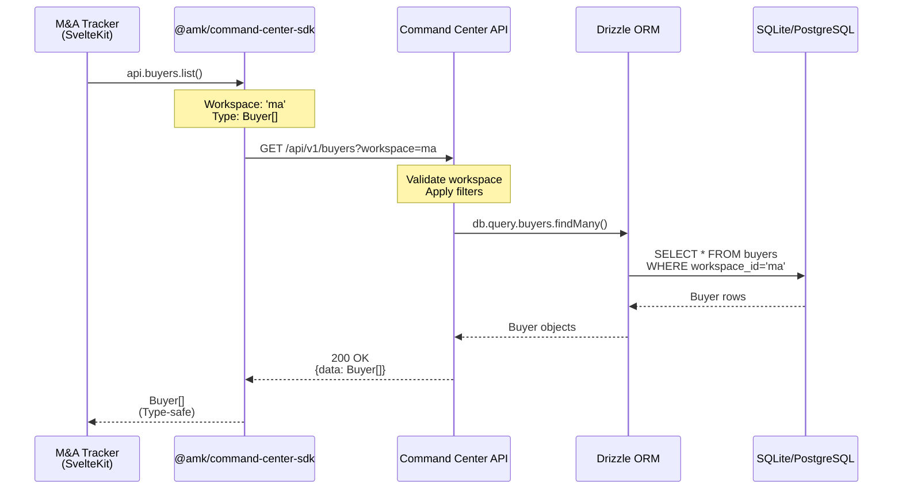
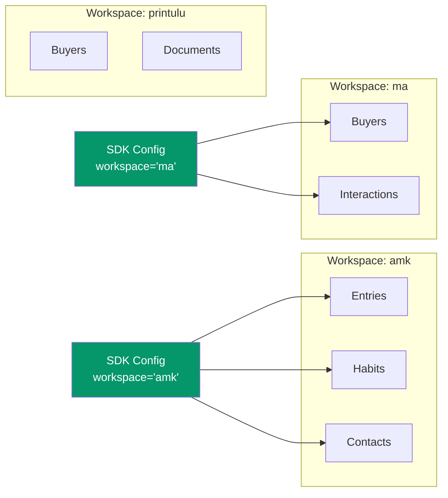
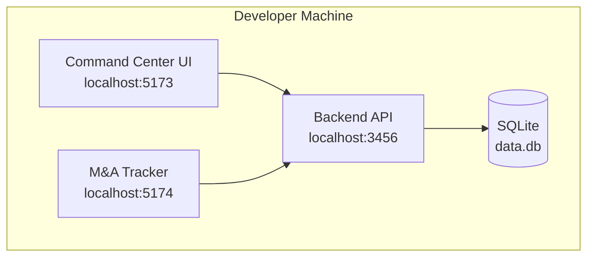
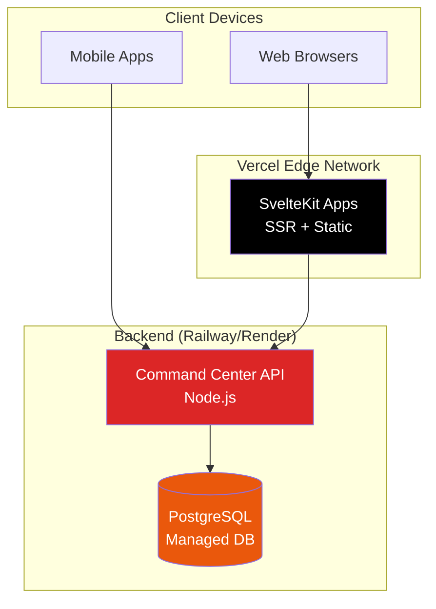
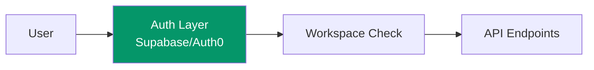
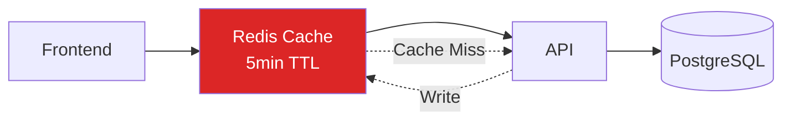
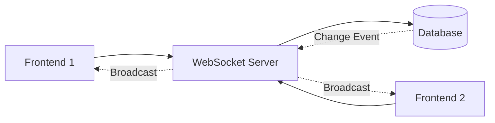

# AMK Command Center - System Architecture

**Version**: 1.0.0
**Date**: 2026-02-14
**Architecture Pattern**: Headless Backend + Multiple Frontends

---

## Executive Summary

The AMK Command Center is a **headless backend architecture** serving multiple specialized frontends through a type-safe TypeScript SDK. The system enables personal productivity tracking (journal entries, habits, CRM) and business intelligence (M&A deal tracking) through a shared database with workspace isolation.

**Key Innovations**:

- Single source of truth (shared database)
- Multi-workspace data isolation (amk, ma, printulu)
- Type-safe end-to-end via TypeScript SDK
- Database-agnostic (SQLite for development, PostgreSQL for production)
- Frontend-agnostic API design

---

## System Overview

```mermaid
graph TB
    subgraph "Frontends"
        CC[Command Center UI<br/>SvelteKit + Svelte 5]
        MA[M&A Tracker<br/>SvelteKit + DaisyUI]
        JU[Journal UI<br/>Future]
        MOB[Mobile Apps<br/>Future]
    end

    subgraph "SDK Layer"
        SDK[@amk/command-center-sdk<br/>TypeScript Client]
    end

    subgraph "Backend API"
        API[Command Center API<br/>Node.js + Express]
        ROUTES[REST Endpoints<br/>/api/v1/*]
    end

    subgraph "Data Layer"
        ORM[Drizzle ORM]
        DB[(SQLite / PostgreSQL<br/>Shared Database)]
    end

    CC --> SDK
    MA --> SDK
    JU -.-> SDK
    MOB -.-> SDK

    SDK --> API
    API --> ROUTES
    ROUTES --> ORM
    ORM --> DB

    style CC fill:#4F46E5,color:#fff
    style MA fill:#7C3AED,color:#fff
    style SDK fill:#059669,color:#fff
    style API fill:#DC2626,color:#fff
    style DB fill:#EA580C,color:#fff
```

---

## Component Architecture

### 1. Frontend Applications

#### Command Center UI (Primary)

- **Technology**: SvelteKit 2.x, Svelte 5 (runes), Tailwind CSS
- **Purpose**: Personal productivity dashboard
- **Features**:
  - Voice-first journal entry creation
  - Morning/Evening reviews
  - Habit tracking (Bryan Johnson Blueprint)
  - Energy & sleep tracking
  - Weekly planning (Warren Buffett 25/5)
  - AI coach system (Bill Campbell, Machiavelli, etc.)
  - Strategic intelligence tools
- **Location**: `/Users/amk/Projects/amk-command-center`
- **Workspace**: `amk` (personal)

#### M&A Tracker (Specialized)

- **Technology**: SvelteKit 2.x, Tailwind CSS, DaisyUI
- **Purpose**: Deal intelligence system for Printulu exit
- **Features**:
  - 5-tier pipeline visualization
  - Buyer fit scoring (0-100)
  - Red flag detection
  - Next action recommendations
  - Deal analytics dashboard
- **Location**: `/Users/amk/Projects/amk-journal/apps/ma-tracker`
- **Workspace**: `ma` (M&A deals)

#### Future Frontends

- **Journal UI**: Markdown-first journal interface
- **Mobile Apps**: React Native or Flutter
- **Desktop Apps**: Electron or Tauri

---

### 2. TypeScript SDK

#### Package: @amk/command-center-sdk

**Purpose**: Type-safe abstraction over Command Center API

**Key Features**:

- ✅ Full TypeScript type safety
- ✅ Request/response validation
- ✅ Error handling with typed exceptions
- ✅ Workspace configuration
- ✅ Dual ESM + CommonJS exports

**API Client Structure**:

```typescript
import { CommandCenterClient } from "@amk/command-center-sdk";

const client = new CommandCenterClient({
  baseUrl: "http://localhost:3456/api/v1",
  workspace: "ma", // or 'amk', 'printulu'
});

// Type-safe API calls
const buyers = await client.buyers.list();
const buyer = await client.buyers.get(buyerId);
await client.buyers.update(buyerId, data);
```

**Exports**:

- `CommandCenterClient` - Main API client
- Type definitions: `Buyer`, `Interaction`, `Entry`, `Habit`, etc.
- Error classes: `ValidationError`, `NotFoundError`, `APIError`

**Location**: `/Users/amk/Projects/amk-journal/packages/command-center-sdk`

---

### 3. Backend API

#### Command Center API

**Technology**: Node.js, Express, Drizzle ORM, SQLite/PostgreSQL

**Base URL**: `http://localhost:3456/api/v1`

**Core Responsibilities**:

1. RESTful API endpoints
2. Workspace-based data isolation
3. Database abstraction via Drizzle ORM
4. Business logic (fit scoring, red flag detection)
5. Cross-origin support for multiple frontends

**Location**: `/Users/amk/Projects/amk-journal/.claude/api`

---

### 4. Database Layer

#### Schema Overview

**Technology**: Drizzle ORM + SQLite (dev) / PostgreSQL (prod)

**Tables**:

```sql
-- M&A Workspace Tables
buyers (
  id, workspace_id, name, company, type,
  asking_price, engagement, response_time_avg_hours,
  fit_score, red_flags_count, created_at, updated_at
)

interactions (
  id, workspace_id, buyer_id, date, channel,
  sentiment, response_time_hours, notes, created_at
)

-- Personal Workspace Tables (Future)
entries (id, workspace_id, date, content, frontmatter, ...)
habits (id, workspace_id, name, streak, ...)
contacts (id, workspace_id, name, company, ...)
```

**Workspace Isolation**: Every table has `workspace_id` column with automatic filtering in queries.

---

## Data Flow Diagrams

### Request Flow: Frontend → SDK → API → Database



---

### Workspace Isolation Pattern



**How It Works**:

1. **SDK Configuration**: Client sets workspace in constructor
2. **Automatic Filtering**: All API calls include `?workspace=<name>`
3. **Database Layer**: Drizzle queries auto-filter by `workspace_id`
4. **Zero Data Leakage**: `ma` workspace cannot access `amk` data

---

## API Endpoints

### Core Resources

#### Buyers (M&A Workspace)

```
GET    /api/v1/buyers?workspace=ma           - List all buyers
GET    /api/v1/buyers/:id?workspace=ma       - Get buyer details
POST   /api/v1/buyers?workspace=ma           - Create buyer
PUT    /api/v1/buyers/:id?workspace=ma       - Update buyer
DELETE /api/v1/buyers/:id?workspace=ma       - Delete buyer
```

#### Interactions

```
GET    /api/v1/buyers/:buyerId/interactions  - Get buyer interactions
POST   /api/v1/buyers/:buyerId/interactions  - Log new interaction
PUT    /api/v1/interactions/:id              - Update interaction
DELETE /api/v1/interactions/:id              - Delete interaction
```

#### Entries (Personal Workspace)

```
GET    /api/v1/entries?workspace=amk         - List journal entries
GET    /api/v1/entries/:date?workspace=amk   - Get entry by date
POST   /api/v1/entries?workspace=amk         - Create entry
PUT    /api/v1/entries/:date?workspace=amk   - Update entry
```

#### Habits (Personal Workspace)

```
GET    /api/v1/habits?workspace=amk          - List habits
POST   /api/v1/habits/:habitId/toggle        - Toggle habit completion
GET    /api/v1/habits/streaks                - Get habit streaks
```

---

## Technology Stack

### Frontend Technologies

| Component           | Technology     | Version                |
| ------------------- | -------------- | ---------------------- |
| Framework           | SvelteKit      | 2.x                    |
| UI Library          | Svelte         | 5.x (runes)            |
| Styling             | Tailwind CSS   | 4.x                    |
| State Management    | Svelte 5 Runes | (`$state`, `$derived`) |
| UI Components (M&A) | DaisyUI        | 4.x                    |
| HTTP Client         | Fetch API      | Native                 |

### Backend Technologies

| Component       | Technology  | Version        |
| --------------- | ----------- | -------------- |
| Runtime         | Node.js     | 18+            |
| Framework       | Express     | 4.x            |
| ORM             | Drizzle ORM | Latest         |
| Database (Dev)  | SQLite      | better-sqlite3 |
| Database (Prod) | PostgreSQL  | 14+            |
| Type Safety     | TypeScript  | 5.3+           |

### Development Tools

| Tool   | Purpose             |
| ------ | ------------------- |
| pnpm   | Package management  |
| Vite   | Frontend build tool |
| tsup   | SDK build tool      |
| Vitest | Testing framework   |

---

## Key Design Patterns

### 1. Workspace Isolation

**Problem**: Multiple users/use cases sharing one database without data leakage

**Solution**: Every table has `workspace_id` column, filtered at API + ORM layers

**Benefits**:

- Single database for all apps
- No data duplication
- Easy to add new workspaces
- Workspace-level backup/restore

---

### 2. Type Safety Chain

**Problem**: Runtime errors from API contract mismatches

**Solution**: TypeScript types flow end-to-end

```
Frontend Types → SDK Types → API Types → Database Schema
     ↑              ↑            ↑              ↑
  (same)        (same)       (same)       (generated)
```

**Benefits**:

- Compile-time error detection
- Autocomplete in IDEs
- Refactoring safety
- Self-documenting code

---

### 3. Backend Agnostic SDK

**Problem**: Tight coupling between frontend and backend implementation

**Solution**: SDK abstracts HTTP layer, returns typed objects

**Benefits**:

- Swap SQLite → PostgreSQL without frontend changes
- Add Redis caching without frontend changes
- Migrate to GraphQL without frontend changes

---

### 4. Hexagonal Architecture (Command Center UI)

The Command Center frontend uses ports & adapters pattern:

```
Components (Presentation)
    ↓
Services (Business Logic)
    ↓
API Interfaces (Ports)
    ↓
Implementations (Adapters)
```

**Current**: localStorage adapter
**Future**: Command Center API adapter (via SDK)

---

## Deployment Architecture

### Development Environment



### Production Environment (Future)



**Deployment Targets**:

- **Frontends**: Vercel (SvelteKit SSR + static)
- **Backend**: Railway, Render, or DigitalOcean App Platform
- **Database**: Supabase PostgreSQL or Railway managed PostgreSQL

---

## Data Models

### Buyer (M&A Workspace)

```typescript
interface Buyer {
  id: string;
  workspace_id: string; // 'ma'
  name: string; // 'Leon BSC'
  company: string; // 'BSC Stationery'
  type: BuyerType; // 'empire-builder' | 'strategic' | 'financial' | 'tire-kicker'
  asking_price_currency: string; // 'ZAR'
  asking_price_amount: number; // 25000000 (R25M)
  engagement: EngagementStatus; // 'accelerating' | 'steady' | 'stalling'
  response_time_avg_hours: number; // 168 (7 days)
  fit_score: number; // 0-100
  red_flags_count: number; // 2
  created_at: Date;
  updated_at: Date;
}
```

### Interaction (M&A Workspace)

```typescript
interface Interaction {
  id: string;
  workspace_id: string; // 'ma'
  buyer_id: string;
  date: Date;
  channel: InteractionChannel; // 'call' | 'email' | 'meeting' | 'whatsapp'
  sentiment: Sentiment; // 'positive' | 'neutral' | 'negative'
  response_time_hours: number | null;
  notes: string;
  created_at: Date;
}
```

### Entry (Personal Workspace)

```typescript
interface Entry {
  id: string;
  workspace_id: string; // 'amk'
  date: string; // 'YYYY-MM-DD'
  content: string; // Markdown body
  frontmatter: Record<string, any>; // YAML frontmatter
  energy: EnergyLevel; // 'high' | 'medium' | 'low' | 'drained'
  sleep_hours: number;
  created_at: Date;
  updated_at: Date;
}
```

---

## Security & Access Control

### Current (Development)

- **Authentication**: None (local development only)
- **Authorization**: Workspace isolation via query parameter
- **Data Access**: All data accessible locally

### Future (Production)



**Planned Security**:

1. **Authentication**: API keys or JWT tokens
2. **Authorization**: User → Workspace mapping in database
3. **Rate Limiting**: Express rate-limit middleware
4. **HTTPS**: Required for production
5. **CORS**: Whitelist specific frontend domains

---

## Migration Path: SQLite → PostgreSQL

### Phase 1: SQLite (Current)

**Advantages**:

- Zero-config local development
- Fast for single-user
- File-based (easy backup)
- No external dependencies

**File Location**: `/Users/amk/Projects/amk-journal/.claude/api/data/command-center.db`

### Phase 2: PostgreSQL (Production)

**Migration Steps**:

1. **Update Drizzle Config**:

   ```typescript
   // drizzle.config.ts
   export default {
     dialect: "postgresql",
     dbCredentials: {
       url: process.env.DATABASE_URL,
     },
   };
   ```

2. **Run Migrations**:

   ```bash
   npm run db:push
   ```

3. **Zero Frontend Changes**: SDK remains identical

**Advantages**:

- Multi-user support
- Better concurrency
- Advanced features (full-text search, JSON queries)
- Managed hosting (Supabase, Railway)

---

## Performance Considerations

### Database Indexing

**Critical Indexes** (already in schema):

```sql
-- Workspace isolation performance
CREATE INDEX idx_buyers_workspace ON buyers(workspace_id);
CREATE INDEX idx_interactions_workspace ON interactions(workspace_id);

-- Foreign key performance
CREATE INDEX idx_interactions_buyer ON interactions(buyer_id);

-- Common query patterns
CREATE INDEX idx_buyers_fit_score ON buyers(fit_score DESC);
CREATE INDEX idx_interactions_date ON interactions(date DESC);
```

### Caching Strategy (Future)



**Cache Keys**:

- `buyers:ma:list` - Buyer list per workspace
- `buyer:ma:{id}` - Individual buyer details
- `interactions:{buyerId}` - Interaction history

**TTL**: 5 minutes for read-heavy data

---

## Monitoring & Observability (Future)

### Metrics to Track

**Backend**:

- Request latency (p50, p95, p99)
- Error rate by endpoint
- Database query time
- API throughput (requests/sec)

**Frontend**:

- Page load time
- Time to interactive (TTI)
- Core Web Vitals
- Error boundary catches

**Tools**:

- **Backend**: Prometheus + Grafana or DataDog
- **Frontend**: Vercel Analytics or Sentry
- **Database**: PostgreSQL slow query log

---

## Testing Strategy

### SDK Testing

```typescript
// packages/command-center-sdk/src/__tests__/buyers.test.ts
import { CommandCenterClient } from "../index";

describe("Buyers API", () => {
  it("lists buyers with workspace filtering", async () => {
    const client = new CommandCenterClient({
      workspace: "ma",
    });
    const buyers = await client.buyers.list();
    expect(buyers.every((b) => b.workspace_id === "ma")).toBe(true);
  });
});
```

### API Testing

```typescript
// .claude/api/tests/routes/buyers.test.ts
describe("GET /api/v1/buyers", () => {
  it("filters by workspace", async () => {
    const res = await request(app)
      .get("/api/v1/buyers?workspace=ma")
      .expect(200);
    expect(res.body.data.length).toBeGreaterThan(0);
  });
});
```

### E2E Testing (Future)

- **Tool**: Playwright
- **Scope**: Critical user flows
- **Example**: Create buyer → Log interaction → View dashboard

---

## Future Enhancements

### 1. Real-time Sync



**Use Case**: Multiple users editing same buyer, see updates instantly

### 2. File Uploads (Data Room)

- Store documents in S3/R2
- Track document access via `document_access` table
- Generate audit trail

### 3. Advanced Analytics

- Pipeline conversion funnel
- Time-to-close metrics
- Win/loss analysis
- Red flag correlation analysis

### 4. Mobile Apps

- React Native or Flutter
- Offline-first with sync
- Push notifications for red flags

---

## Development Workflow

### Starting the System

```bash
# Terminal 1: Backend API
cd /Users/amk/Projects/amk-journal/.claude/api
npm start  # http://localhost:3456

# Terminal 2: Command Center UI
cd /Users/amk/Projects/amk-command-center
npm run dev  # http://localhost:5173

# Terminal 3: M&A Tracker
cd /Users/amk/Projects/amk-journal/apps/ma-tracker
npm run dev  # http://localhost:5174
```

### Database Management

```bash
# Run migrations
cd /Users/amk/Projects/amk-journal/.claude/api
npm run db:migrate

# Seed M&A buyers
npm run db:seed

# Open Drizzle Studio (database GUI)
npm run db:studio
```

### SDK Development

```bash
# Build SDK
cd /Users/amk/Projects/amk-journal/packages/command-center-sdk
npm run build

# Watch mode (auto-rebuild on changes)
npm run dev

# Run tests
npm test
```

---

## Troubleshooting

### "Cannot connect to API"

1. Check backend is running: `curl http://localhost:3456/health`
2. Check SDK config: `baseUrl: 'http://localhost:3456/api/v1'`
3. Check CORS headers in API

### "Workspace data not isolated"

1. Verify `workspace_id` in database: `SELECT DISTINCT workspace_id FROM buyers`
2. Check API query params: `?workspace=ma` in URL
3. Check SDK config: `workspace: 'ma'` in constructor

### "Type errors in frontend"

1. Rebuild SDK: `cd packages/command-center-sdk && npm run build`
2. Reinstall in frontend: `npm install @amk/command-center-sdk@latest`
3. Check TypeScript version compatibility

---

## References

### Documentation

- [Backend API Documentation](/Users/amk/Projects/amk-journal/.claude/api/API.md)
- [M&A Tracker README](/Users/amk/Projects/amk-journal/apps/ma-tracker/README.md)
- [Command Center README](/Users/amk/Projects/amk-command-center/README.md)
- [SDK Package](/Users/amk/Projects/amk-journal/packages/command-center-sdk)

### Architecture Patterns

- [Hexagonal Architecture](https://alistair.cockburn.us/hexagonal-architecture/)
- [Clean Architecture (Uncle Bob)](https://blog.cleancoder.com/uncle-bob/2012/08/13/the-clean-architecture.html)
- [API-First Design](https://swagger.io/resources/articles/adopting-an-api-first-approach/)

---

## Changelog

### 2026-02-14 - Phase 3 Complete

- ✅ M&A Tracker migrated to shared database
- ✅ Full CRUD support for buyers and interactions
- ✅ TypeScript SDK published
- ✅ Workspace isolation implemented
- ✅ Removed local API routes from M&A Tracker
- ✅ Backend handles all data persistence

### 2026-02-11 - Initial Architecture

- ✅ Command Center UI with localStorage
- ✅ Backend API with SQLite
- ✅ M&A Tracker prototype
- ✅ Hexagonal architecture pattern

---

**Maintained by**: Alexander Knieps
**Last Updated**: 2026-02-14
**Architecture Version**: 1.0.0
